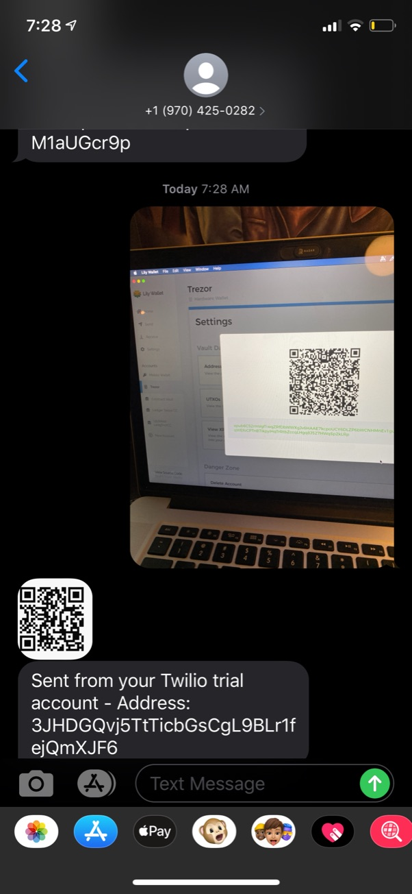

# twilio-btc-wallet
Twilio function for getting new Bitcoin wallet address from image of XPub

## Steps
1) Take image of QR code with encoded XPub (try success-example-image.jpeg)
2) Send image to phone number (ex +19704250282)
3) P2SH(P2WSH) address returned with QR Code Image
4) Send money to address
5) Send image from Step 1 again
6) New BTC Address returned

## Use Case
Get receive addresses for your wallet without having to download an app

Obviously this isn't good for privacy since you are storing an image of your XPub on someone else's server, but just a fun project to learn about the Twilio Node Helper Library and CLI.

Video: [https://twitter.com/KayBeSee/status/1298261868092387329](https://twitter.com/KayBeSee/status/1298261868092387329)

